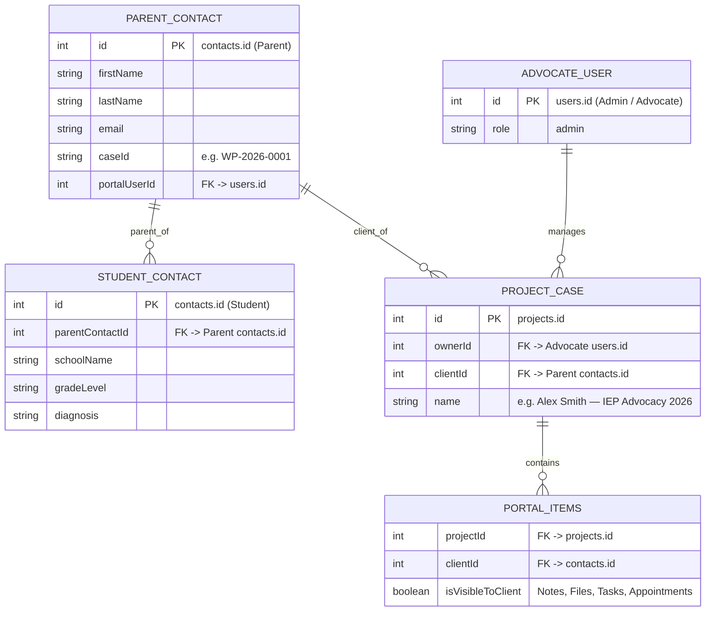
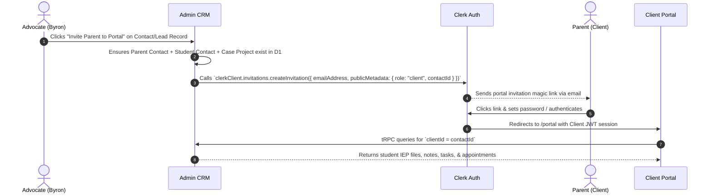

# Client Portal Auth Architecture & Account Creation Blueprint

**Project**: Waypoint Advocates — Custom CRM Pro  
**Author**: Veritas Technology Solutions / Antigravity AI  
**Date**: July 30, 2026  
**Status**: Architecture Document & Sprint Plan  

---

## 1. Overview & Data Model Architecture

The Client Portal provides parents with secure, self-service access to their child’s IEP advocacy case, documents, billing invoices, appointments, and progress tasks.

---

## 2. Key Entity Relationships

1. **Parent Contact Record (`contacts` table)**:
   - Holds parent's name, primary email, phone, case ID (e.g. `WP-2026-0001`), and `portalUserId`.
   - Represents the primary client account.

2. **Student Contact Record (`contacts` table)**:
   - Holds student details (DOB, diagnosis, school name, grade level, district, IEP challenges).
   - Linked to Parent via `parentContactId = parent.id`.

3. **Student Case Project (`projects` table)**:
   - Represents the active advocacy engagement.
   - Linked via `clientId = parent.id`.
   - Houses `projectTasks`, `clientFiles`, `notes` (marked `isVisibleToClient = true`), `appointments`, `contracts`, and `invoices`.

4. **Clerk Client Authentication (`Clerk Auth`)**:
   - Parent authenticates at `/portal/login` (or `/portal`).
   - Clerk issues JWT session with claims: `{ role: "client", contactId: parent.id }`.
   - Portal queries records where `clientId = contactId`, immediately populating their child's case workspace.

---

## 3. Account Provisioning Flow

---

## 4. Test Group Onboarding Plan

To onboard and verify your initial client test group:
1. **Admin Action**: Add **"Provision Portal Access"** button to the Contacts / Clients view in Admin.
2. **Seed Data**: Create test parent contacts (e.g., test parent email) linked to sample student projects.
3. **Verification**: Log into the live portal (`https://custom-crm-pro.clientcare-fa6.workers.dev/portal`) as test parents to verify student case data isolation.
